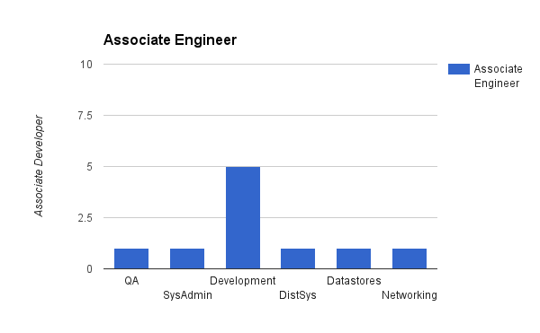
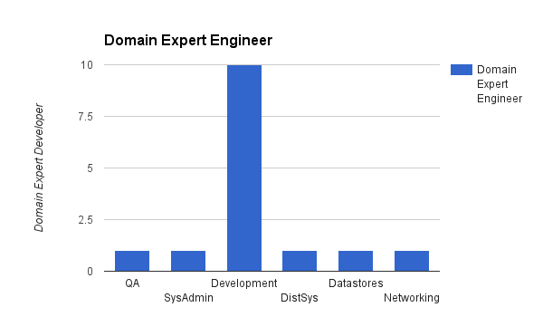
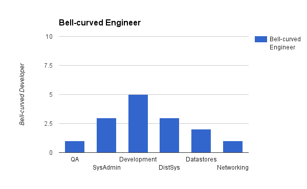

Imagine you have a fresh engineer. You're able to grade her on a 1-10 score for the domains she has knowledge in. If you were to score her, she looks like this.

She joins your company, and you're tasked with growing her in the most efficient way for the business. Say you can add 5 points to her domains.

Is it more valuable to have her become a domain expert, like:

Or is it better to have her become more bell curve shaped?

